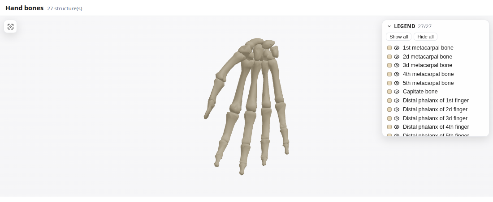

# ANATOMED MCP

Interactive, region-isolated **3D anatomy**, rendered **inline in Claude**. Ask for an
anatomical structure or region and a live, rotatable 3D model appears right in the chat —
showing only what you asked for, with a legend to toggle each structure on and off.

🔗 **Live connector:** `https://anatomed-mcp.vercel.app/mcp`



---

## Use it in Claude

1. **Settings → Connectors → Add custom connector**
2. Paste the URL: `https://anatomed-mcp.vercel.app/mcp`
3. Enable it in a chat (the tools **+** menu), then ask for anatomy.

### Things to ask

| Prompt | Shows |
|--------|-------|
| “Show me the **cervical spine** in 3D” | A named region (7 vertebrae) |
| “Show the **bones of the hand**” | 27 structures with a full legend |
| “Show the **femur, femoral artery and femoral nerve** together” | Bone + vessel + nerve, colour-coded |
| “Show the **sciatic nerve** and what it runs near” | Focus structure **+ translucent context** |
| “Show the **skull bones**” | Cranium, colour-tinted and fitted |

**Interacting with the model:** drag to rotate · scroll to zoom · **right-drag to pan** ·
**hover** a structure to see its name · toggle structures in the **legend** · the
**recenter** button (top-left) re-frames the view.

> Some structures are decomposed in the source model (e.g. **Heart**, **Lung**, **Sternum**)
> and won't resolve as a single mesh. Whole bones, major vessels and nerves, organs, and the
> named regions above all work well.

---

## How it works

```
Claude ──tools/call show_anatomy_region──▶  MCP server (this app)
        ◀── structuredContent (region) ───   resolves a bounded set of parts
Claude ──resources/read ui://… ──────────▶  serves the single-file widget HTML
        └─ renders it in a sandboxed iframe; the widget fetches only the needed
           GLBs from Supabase (whitelisted via _meta.ui.csp), isolates the region,
           and draws the legend with per-structure toggles.
```

The widget **never renders a whole body system** — always a bounded *region* (capped at
`MAX_REGION_PARTS`). The `detail` parameter controls surrounding context:
`isolated` (default) · `related` (nearest neighbours, translucent) · `regional` (wider context).

---

## Run locally

```bash
npm install
npm run build:widget    # build the single-file widget → dist/index.html
npm start               # MCP server on http://localhost:3000  (POST /mcp)
```

Preview the widget without Claude (no MCP host needed):

```
http://localhost:3000/widget-preview?region=cervical spine
http://localhost:3000/widget-preview?parts=Femur,Femoral artery,Femoral nerve&detail=related
```

The 3D models load from a public Supabase bucket by default, so there's nothing else to set up.
Run the headless protocol check with `npx tsx scripts/smoke.ts`.

---

## Deploy

Hosted on **Vercel** — every push to `main` auto-deploys. To deploy manually:

```bash
npx vercel deploy --prod
```

The Express app is served as a single serverless function (`api/index.ts`); `vercel.json`
builds the widget and bundles the catalog/data files into the function. No environment
variables are required (asset URL defaults to the public Supabase bucket).

### Updating the 3D models

GLBs live in a public Supabase Storage bucket (gitignored locally). To re-upload after a
model change: `cp .env.example .env`, fill in the Supabase keys, then `npm run upload:assets`.

---

## Project layout

| Path | What |
|------|------|
| `src/app.ts` | Express app — `show_anatomy_region` tool + `ui://` widget resource (CSP) + routes |
| `src/server.ts` | Local dev server (listens on `:3000`) |
| `api/index.ts` | Vercel serverless entry (serves the same app) |
| `src/region.ts` | Resolve a query → bounded region payload |
| `src/catalog.ts`, `src/neighbors.ts` | Parts catalog + nearest-neighbour (context) data |
| `src/vendor/` | Vendored from anatomed-web (types, fuzzy match, group resolution) |
| `widget/` | Single-file R3F widget — `RegionViewer` (rotate/zoom/pan/hover) + legend |
| `public/index.html` | Static landing page |
| `assets/parts-catalog.json` | Committed catalog (resolution source) |
| `assets/glb/*.glb` | Gitignored; hosted on Supabase |

For architecture details and project conventions, see [`CLAUDE.md`](CLAUDE.md).
